# Voiceback - LLM-Powered Voice Agent

A conversational voice agent that shares wisdom from ancient philosophers to provide supportive insights through natural phone conversations.

## 🎯 Simple User Journey

1. **User calls** → 2. **Vapi answers & transcribes** → 3. **Flask processes & generates wisdom** → 4. **LLM responds with philosophy** → 5. **Vapi speaks response** → 6. **User hears ancient wisdom**

## ✨ Key Features

- **Ancient Philosophy Guidance**: Draw wisdom from Stoics, Greeks, Eastern philosophers to help with modern challenges
- **Natural Voice Conversations**: LLM-powered responses that understand context and provide philosophical support
- **Crisis Detection**: Built-in safety with emergency hotline information for crisis situations
- **Multiple LLM Support**: Compatible with OpenAI, xAI, and future Anthropic support
- **Simple Architecture**: Clean, maintainable codebase with webhook-based real-time processing
- **Real-time Processing**: Instant philosophical insights through Vapi webhook integration

## 🏗️ System Architecture

### High-Level Flow
```
┌─────────────┐  ┌──────────────┐  ┌─────────────┐  ┌─────────────┐  ┌─────────────┐
│    User     │  │     Vapi     │  │   Flask     │  │     LLM     │  │ Philosophy  │
│   (Phone)   │◄─┤  (Speech     │◄─┤  (Webhook   │◄─┤ (OpenAI/    │◄─┤   Wisdom    │
│             │  │   AI)        │  │   Server)   │  │   xAI)      │  │  Database   │
└─────────────┘  └──────────────┘  └─────────────┘  └─────────────┘  └─────────────┘
```

### Detailed Call Flow

```mermaid
sequenceDiagram
    participant User as 📞 User
    participant Vapi as 🎤 Vapi AI
    participant Flask as 🌐 Flask Server
    participant CallHandler as 🧠 CallHandler
    participant LLM as 🤖 LLM (OpenAI/xAI)
    participant Philosophy as 📚 Ancient Wisdom

    User->>Vapi: 1. Places call to +1 (414) 441 9889
    Vapi->>Flask: 2. POST /webhook (call.started)
    Flask->>CallHandler: 3. handle_webhook(call_started)
    CallHandler->>Vapi: 4. Returns assistant config
    
    User->>Vapi: 5. Speaks about challenge/problem
    Vapi->>Vapi: 6. Speech-to-text transcription
    Vapi->>Flask: 7. POST /webhook (function-call)
    Flask->>CallHandler: 8. handle_webhook(function_call)
    
    CallHandler->>CallHandler: 9. Check for crisis keywords
    alt Crisis Detected
        CallHandler->>User: Emergency resources (988/AASRA)
    else Normal Conversation
        CallHandler->>LLM: 10. Generate philosophical response
        LLM->>Philosophy: 11. Access ancient wisdom
        Philosophy->>LLM: 12. Return relevant insights
        LLM->>CallHandler: 13. Philosophical guidance
        CallHandler->>Flask: 14. Return LLM response
        Flask->>Vapi: 15. JSON response with wisdom
        Vapi->>Vapi: 16. Text-to-speech conversion
        Vapi->>User: 17. Speaks philosophical guidance
    end
    
    User->>Vapi: 18. Ends call
    Vapi->>Flask: 19. POST /webhook (call.ended)
    Flask->>CallHandler: 20. handle_webhook(call_ended)
    CallHandler->>CallHandler: 21. Cleanup call session
```



### Core Components

#### 1. **Flask Webhook Server** (`src/main.py`)
- **Purpose**: HTTP server that receives real-time webhooks from Vapi
- **Endpoints**:
  - `POST /webhook` - Processes call events and voice transcripts
  - `GET /health` - Health monitoring with component status
  - `GET /calls` - Active call management
- **Responsibilities**:
  - Validates environment variables (API keys, phone numbers)
  - Manages server lifecycle and graceful shutdown
  - Routes webhook events to CallHandler
  - Provides monitoring and debugging endpoints

#### 2. **CallHandler** (`src/call_handler.py`)
- **Purpose**: Core business logic for processing voice conversations
- **Key Features**:
  - **Ancient Philosophy System Prompt**: Guides LLM to share wisdom from Stoics, Greeks, Eastern philosophers
  - **Crisis Detection**: Scans for self-harm keywords and provides emergency resources
  - **Multi-LLM Support**: Adapts to OpenAI, xAI, or Anthropic APIs
  - **Session Management**: Tracks active calls and conversation context
- **Philosophy Integration**:
  - Maps user challenges to philosophical themes (resilience, purpose, mortality)
  - Connects modern problems with ancient wisdom
  - Shares historical context from Marcus Aurelius, Epictetus, Seneca, etc.

#### 3. **VapiClient** (`src/vapi_client.py`)
- **Purpose**: Manages integration with Vapi's voice AI platform
- **Capabilities**:
  - **Health Checks**: Validates API connectivity and authentication
  - **Phone Number Management**: Configures webhook endpoints for incoming calls
  - **Assistant Configuration**: Sets up voice agent parameters and prompts
  - **Call Management**: Handles call lifecycle and status monitoring
- **Error Handling**: Comprehensive exception handling for network and API failures

#### 4. **LLM Integration**
- **Supported Providers**:
  - **OpenAI**: Primary provider with GPT-4 models
  - **xAI**: Grok models via OpenAI-compatible API
  - **Anthropic**: Planned future support for Claude models
- **Philosophy Prompt Engineering**:
  - Structured system prompt with philosophical guidance
  - Historical context integration
  - Practical wisdom application to modern challenges

### Infrastructure Components

#### **Vapi Voice AI Platform**
- **Speech Recognition**: Converts user voice to text in real-time
- **Text-to-Speech**: Converts AI responses back to natural speech
- **Call Management**: Handles phone system integration and call routing
- **Webhook Delivery**: Sends call events and transcripts to Flask server

#### **Environment & Configuration**
- **Environment Variables**: API keys, phone numbers, server settings
- **Logging**: Structured logging with loguru for debugging and monitoring
- **Health Monitoring**: Real-time status checks for all system components

### Data Flow Patterns

#### **Webhook Event Types**
1. **`call.started`**: Initializes call session and returns assistant configuration
2. **`function-call`**: Processes user speech and generates philosophical responses
3. **`assistant-request`**: Handles initial assistant setup for the call
4. **`call.ended`**: Cleans up call session and resources

#### **Response Generation Flow**
1. **Input Processing**: Extract user transcript from Vapi webhook
2. **Crisis Check**: Scan for emergency keywords and provide immediate resources
3. **Context Building**: Prepare conversation history and philosophical context
4. **LLM Query**: Send structured prompt to AI with user's situation
5. **Wisdom Retrieval**: LLM accesses relevant ancient philosophical insights
6. **Response Crafting**: Generate personalized guidance with historical context
7. **Safety Addition**: Append disclaimer about inspiration vs. professional advice

#### **Error Handling & Resilience**
- **API Failures**: Graceful degradation with fallback responses
- **Network Issues**: Retry logic and timeout handling
- **Invalid Requests**: Comprehensive input validation and error responses
- **Resource Cleanup**: Proper session management and memory cleanup

This architecture ensures reliable, real-time philosophical guidance through voice conversations while maintaining safety, scalability, and maintainability.

## 🚀 Quick Start

### 1. Environment Setup

```bash
# Clone repository
git clone https://github.com/yourusername/voiceback.git
cd voiceback

# Create virtual environment
python -m venv venv
source venv/bin/activate  # On Windows: venv\Scripts\activate

# Install dependencies
pip install -r requirements.txt
```

### 2. Configuration

Copy `.env.template` to `.env` and configure:

```env
# Required
VAPI_API_KEY=your_vapi_api_key
PHONE_NUMBER=your_vapi_phone_number
OPENAI_API_KEY=your_openai_api_key

# Optional
WEBHOOK_HOST=localhost
WEBHOOK_PORT=5000
LLM_PROVIDER=openai
LOG_LEVEL=INFO
```

### 3. Run the Agent

```bash
# Start the voice agent
python src/main.py
```

The server will start and display:
```
Voiceback Voice Agent is running!
Webhook endpoints:
  - Webhook: http://localhost:5000/webhook
  - Health Check: http://localhost:5000/health  
  - Active Calls: http://localhost:5000/calls
```

## 🧪 Testing

```bash
# Run all tests
pytest

# Run specific test suites
pytest tests/test_call_handler.py -v
pytest tests/test_main.py -v
pytest tests/test_vapi_client.py -v

# See the example in action
python example_usage.py
```

## 🔧 API Endpoints

### Webhook (`POST /webhook`)
Receives Vapi call events and processes user voice input through LLM.

### Health Check (`GET /health`)
```json
{
  "status": "healthy",
  "service": "Voiceback Voice Agent", 
  "checks": {
    "vapi": {"status": "connected"},
    "llm": {"provider": "openai", "status": "configured"},
    "calls": {"count": 0, "status": "active"}
  }
}
```

### Active Calls (`GET /calls`)
```json
{
  "status": "success",
  "calls": {"call-123": {"status": "active", "started_at": "2024-01-01T12:00:00"}},
  "count": 1
}
```

## 🛡️ Safety Features

**Crisis Detection**: Automatically detects keywords like "suicide", "kill myself", etc. and provides:
- US Suicide & Crisis Lifeline: **988**
- India AASRA: **9152987821**  
- Immediate emotional support and professional help guidance

**Disclaimer**: All responses include "Remember, this is for inspiration and support, not professional advice."

## 📁 Project Structure

```
voiceback/
├── src/
│   ├── main.py              # Flask server entry point
│   ├── call_handler.py      # LLM-powered webhook processing  
│   └── vapi_client.py       # Vapi API integration
├── tests/
│   ├── test_call_handler.py # CallHandler tests
│   ├── test_main.py         # Main server tests
│   └── test_vapi_client.py  # VapiClient tests
├── example_usage.py         # Demo script
├── requirements.txt         # Python dependencies
└── .env.template           # Environment configuration template
```

## 🔄 Development

### Adding New LLM Providers

1. Update `CallHandler.__init__()` to handle new provider
2. Add API key validation in `main.py`
3. Implement provider-specific response generation in `_generate_llm_response()`

### Customizing Responses

Modify the `system_prompt` in `CallHandler` to adjust the agent's personality and response style.

### Extending Crisis Detection

Add keywords to `CRISIS_KEYWORDS` list or implement more sophisticated detection logic.

## 📊 Benefits vs Previous Architecture

| Aspect | Old Complex System | New LLM System |
|--------|-------------------|----------------|
| **Responses** | Hardcoded quotes | Natural AI conversations |
| **Input Handling** | Complex text processing | Direct LLM understanding |
| **Maintenance** | Multiple config files | Simple system prompt |
| **Flexibility** | Fixed emotion categories | Handles any user input |
| **Codebase** | ~150KB+ components | ~30KB clean code |

## 🤝 Contributing

1. Fork the repository
2. Create your feature branch (`git checkout -b feature/amazing-feature`)
3. Run tests (`pytest`)
4. Commit your changes (`git commit -m 'Add amazing feature'`)
5. Push to the branch (`git push origin feature/amazing-feature`)
6. Open a Pull Request

**Voiceback** - Providing compassionate support through the power of voice and AI 💙

